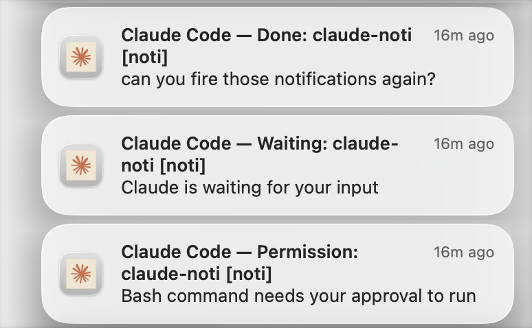

# Claude Code Notifier (terminal-notifier fork)

A Claude-branded fork of [`terminal-notifier`](https://github.com/julienXX/terminal-notifier) that wires native **macOS notifications** into [Claude Code](https://docs.claude.com/en/docs/claude-code/) hooks — and (optionally) makes a click on the notification jump back to the originating **tmux pane**.

When Claude finishes a task or needs your input, you get a native macOS notification with the Claude icon, the actual task content, and (with tmux mode) one click takes you straight back to the pane where that Claude session lives.



---

## Quick start

```bash
git clone https://github.com/LordHung/terminal-notifier.git
cd terminal-notifier

# Default install — no tmux integration
make setup

# Or, if you launch Claude Code from inside tmux and want
# clicking the notification to jump back to that pane:
make setup-tmux
```

That's it. `make setup` builds the Claude-branded bundle, drops the binary + hook scripts into `~/.claude/hooks/`, registers the bundle with macOS LaunchServices, and merges the right `Notification` + `Stop` hook entries into `~/.claude/settings.json` (preserving any other hooks you already have, with a timestamped backup).

After installation, **grant notification permission** to "Claude Code" in *System Settings → Notifications* — see the [permission gotcha](#macos-notification-permissions-critical) below. Without it, notifications fire silently or fall back to a path with no click handler.

### What you get

| Hook | Title format | Body | Sound |
|---|---|---|---|
| `Notification` (`permission_prompt`) | `Claude Code — Permission: <session> [<tmux-window>]` | Hook's `notification_message` | Glass |
| `Notification` (`idle_prompt`) | `Claude Code — Waiting: <session> [<tmux-window>]` | Hook's `notification_message` | Blow |
| `Stop` | `Claude Code — Done: <session> [<tmux-window>]` | Most recent user prompt (≤160 chars) | Ping |

`<session>` is the Claude Code session name set via `/rename`, falling back to git branch, then cwd basename. `<tmux-window>` only shows up when running inside tmux.

The `SubagentStop` hook is intentionally omitted — subagent completions are noisy and don't carry useful context for the human.

---

## What this fork changes vs. upstream

| Property | Upstream `terminal-notifier` | This fork |
|---|---|---|
| `CFBundleIdentifier` | `fr.julienxx.oss.terminal-notifier` | `com.anthropic.claudecode-notifier` |
| `CFBundleName` / `CFBundleDisplayName` | `terminal-notifier` | `Claude Code` |
| App icon (`Terminal.icns`) | macOS terminal icon | Claude logo |
| Bundled Claude Code hook scripts (`hooks/`) | — | included |
| Makefile-based installer | — | included |
| CLI executable name | `terminal-notifier` | `terminal-notifier` (unchanged — drop-in) |
| Source code | (no changes) | (no changes) |

Renaming the bundle ID is the important part: macOS treats this as a separate app in *System Settings → Notifications*, so you can grant notification permission to **Claude Code** without affecting any other `terminal-notifier` install.

---

## Why a custom bundle is needed

The default Claude Code Notification hook uses `osascript -e 'display notification ...'`, which on macOS has **no click handler** — clicks open the Script Editor instead of doing something useful. `terminal-notifier`'s `-execute` flag fixes that, but to display notifications under a "Claude Code" identity (with the Claude icon and "Claude Code" header) you need a separately-branded bundle. Hence this fork.

---

## Prerequisites

| Tool | Required for | Install |
|---|---|---|
| Xcode + Command Line Tools | Building the bundle | App Store, then `xcode-select --install` |
| `jq` | Stop-hook parsing + safe `settings.json` merging | `brew install jq` |
| [Claude Code](https://docs.claude.com/en/docs/claude-code/) | The whole point | `npm i -g @anthropic-ai/claude-code` |
| `tmux` | `setup-tmux` only — click-to-jump-back-to-pane | `brew install tmux` |
| Any terminal (Alacritty, iTerm, Ghostty, …) | `setup-tmux` only | e.g. `brew install --cask alacritty` |

`make setup` runs a `check-deps` step up front and aborts with a clear error if `xcodebuild` or `jq` is missing.

---

## Makefile targets

```text
make setup        Build + install (no tmux click navigation)
make setup-tmux   Build + install + tmux click-back-to-pane wiring
make uninstall    Remove the .app, hook scripts, and hook entries
make build        Build Claude Notifier.app only
make clean        Remove build artifacts
```

`make setup` runs the full pipeline:
1. `build` — `xcodebuild` the Claude-branded bundle
2. `install-app` — copy `Claude Notifier.app` into `~/.claude/hooks/` and register with LaunchServices
3. `install-hooks` — install `notify.sh`, `build-title.sh`, `notification.sh`, `stop.sh` into `~/.claude/hooks/`
4. `settings` — merge the three Claude Code hook entries into `~/.claude/settings.json` via `jq` (with a timestamped backup)

`make setup-tmux` adds one more step in between (`install-tmux-hooks`) that drops `click-action.sh` into `~/.claude/hooks/`. `notify.sh` enables click navigation automatically when it detects that script is present.

Override the install location:
```bash
make setup PREFIX=/some/other/path
```

---

## macOS notification permissions (CRITICAL)

This step is the #1 source of "I clicked the notification but nothing happened" — because if notifications are denied, macOS still renders them through a **fallback path that has no click handler**. There is no error; clicks just silently no-op.

1. Open **System Settings → Notifications**.
2. Find **Claude Code** in the app list (it appears after `make setup` registers the bundle; you may need to fire one notification first for it to show up).
3. Set:
   - **Allow notifications:** ON
   - **Alert style:** **Persistent** (not Banner — Banner notifications can dismiss before you click)
   - Show in: Desktop, Notification Center (your choice)

If "Claude Code" is missing from the list, fire the smoke-test:
```bash
"$HOME/.claude/hooks/Claude Notifier.app/Contents/MacOS/terminal-notifier" \
  -title "Claude Code" -message "Install OK"
```

---

## File layout after install

```
~/.claude/
├── settings.json                 # hook entries merged here
└── hooks/
    ├── Claude Notifier.app/      # rebuilt, Claude-branded bundle
    ├── claude-icon.png           # used only by Homebrew terminal-notifier fallback
    ├── notify.sh                 # main notification dispatcher
    ├── build-title.sh            # session-name + tmux-window title builder
    ├── notification.sh           # Notification-hook handler (Permission / Waiting)
    ├── stop.sh                   # Stop-hook handler (Done + last prompt)
    └── click-action.sh           # tmux pane navigation on click (setup-tmux only)
```

The hook scripts live in this repo under [`hooks/`](hooks/) and the installer script under [`scripts/`](scripts/), so you can audit them before running `make setup`.

---

## How click-to-tmux-pane works

```
┌───────────────────────────────────────────────────────────────┐
│ Claude session running in tmux pane %293 (Alacritty)          │
└───────────────────────────────────────────────────────────────┘
                            │
                  Stop hook fires after Claude responds
                            │
                            ▼
        notify.sh captures $TMUX_PANE = %293
        resolves to session "9", window "9:28"
        bakes into terminal-notifier -execute command:
            click-action.sh '%293' '9:28' '9'
                            │
                            ▼
          terminal-notifier shows native notification
                            │
                  user clicks notification body
                            │
                            ▼
                  click-action.sh runs:
            tmux switch-client -t 9
            tmux select-window -t 9:28
            tmux select-pane -t %293
            open -a Alacritty
                            │
                            ▼
        ┌─────────────────────────────────────────┐
        │ Alacritty foreground, tmux on pane %293 │
        └─────────────────────────────────────────┘
```

**Key insight:** `$TMUX_PANE` is captured **at hook spawn time** (when Claude Code spawns the hook, it inherits the env from the tmux client). The pane ID is then baked into the click command as a string literal, so even though terminal-notifier's click subshell has no `$TMUX` env, it knows exactly which pane to navigate to.

---

## Customization

### Different terminal emulator

Edit `~/.claude/hooks/click-action.sh` and replace `Alacritty` with your terminal app name (e.g., `Terminal`, `iTerm`, `Ghostty`, `WezTerm`). Use the exact name as it appears in `/Applications/`.

### Skip tmux entirely

Use `make setup` instead of `make setup-tmux`. `notify.sh` checks for `click-action.sh` at runtime — if it's not present, click navigation is silently disabled and notifications still fire normally.

### Different install location

Override `PREFIX` on the make command line:
```bash
make setup PREFIX=$HOME/dotfiles/claude-hooks
```
Note: Claude Code reads hooks from `~/.claude/settings.json`, so if you change the prefix you'll also want to make sure the settings entries point at the same location (re-run `make settings PREFIX=...`).

### Custom icon

Replace `Terminal.icns` in this repo with a different `.icns` file (build via `iconutil -c icns YourIcon.iconset`), then `make clean && make setup`.

---

## Troubleshooting

### "I see notifications but clicks don't navigate"

99% of the time this is the **notification permission gotcha**. Open *System Settings → Notifications → Claude Code*, and make sure:
- Allow notifications is ON
- Alert style is Persistent

If notifications are off, macOS routes them through a fallback path that has no click handler. You'll see them but clicks silently no-op.

### "I see no notifications at all"

```bash
"$HOME/.claude/hooks/Claude Notifier.app/Contents/MacOS/terminal-notifier" \
  -title "Test" -message "Hello"
```

If you still see nothing, check:
- macOS Focus / Do Not Disturb is off
- LaunchServices recognizes the bundle: `lsregister -dump | grep claudecode-notifier`

### "Click jumps to Alacritty but wrong tmux pane"

Look at `/tmp/nf-click.log` — `click-action.sh` logs every click with the pane it tried to navigate to. Common causes:
- Claude Code wasn't launched from inside tmux when the hook fired (no `$TMUX_PANE` to capture)
- The pane was killed between the notification firing and you clicking
- Multiple tmux servers (rare)

### "I want to use the homebrew `terminal-notifier` instead of rebuilding"

Skip `make build`/`make install-app` and only run `make install-hooks settings`. `notify.sh` falls back to whatever `terminal-notifier` is on `$PATH`. You'll see "terminal-notifier" as the notification header (with the terminal icon), but everything else still works.

### Uninstall

```bash
make uninstall
```

This removes the bundle and hook scripts from `~/.claude/hooks/`. It does **not** edit `settings.json` automatically — remove the `Notification` + `Stop` hook entries by hand if you want them gone (a backup like `settings.json.bak.<timestamp>` will exist from when `make setup` first ran).

---

## Credits

This fork is a thin rebrand on top of [`terminal-notifier`](https://github.com/julienXX/terminal-notifier) by [Eloy Durán](https://github.com/alloy) and [Julien Blanchard](https://github.com/julienXX). All the actual notification work is theirs — this fork only changes the bundle identity to play nicely with macOS's per-app permission model so it can be branded as "Claude Code", and adds Claude Code-specific hook scripts + a Makefile installer.

The Claude logo and the "Claude Code" name are trademarks of [Anthropic](https://anthropic.com). This fork is unaffiliated with Anthropic — it's a personal customization for the [Claude Code](https://docs.claude.com/en/docs/claude-code/) CLI.

## License

MIT, same as upstream. See [`LICENSE.md`](LICENSE.md).
